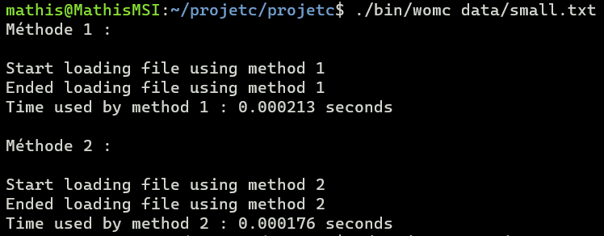
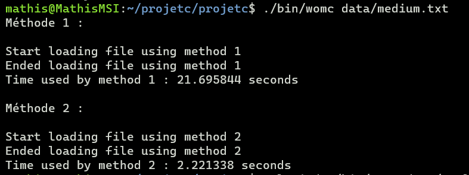
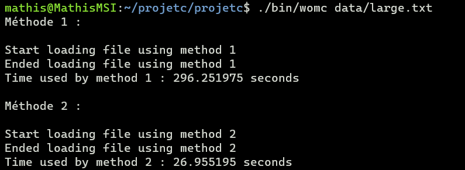

# Notes on the project

Voici mes notes sur le projet et les résultats concernant les 2 méthodes de traitement des fichiers.

## Function make_cell_from_line

For this function, we use the `string.h` library.
In this one, we have the function `strtok`

## Remarques

Pour faire un checkup des allocations de mémoire et du programme, on utilise `valgrind`

## Captures d'écran sur les résultats du programme

Voici quelques images sur les résultats des 2 méthodes de listes. (Respectivement pour le fichier `small.txt`, `medium.txt` et `large.txt`)

## Création d'une documentation pour le projet C

Utilisation de Doxygen pour générer la documentation automatiquement à partir des commentaires dans le code. \
Référence pour l'utilisation de `doxygen` en CLI : [doxygen usage](https://doxygen.nl/manual/doxygen_usage.html) \

Pour bien l'utiliser, il faut bien mettre en forme les commentaires dans le code et utiliser la syntaxe de la doc. \
Ensuite, quand on veut générer la documentation, on se réfère au fichier de configuration que l'on a créé et on vérifie s'il y a bien les bons dossiers et paramètres mis en place pour générer la doc. \
Il est notamment important de mettre l'endroit vers les codes sources dans le paramètre `INPUT`.

Ensuite, on utilise les commandes suivantes :
`doxygen nom_fichier_config`. \
Et tous les fichiers sont générés en fonction de la configuration choisie. \
Pour générer le fichier de configuration, on utilise `doxygen -g nom_fichier_config`
