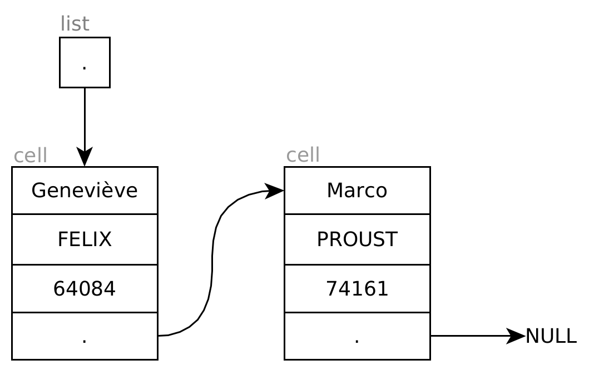
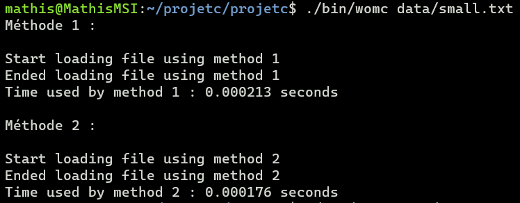
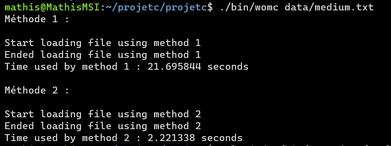
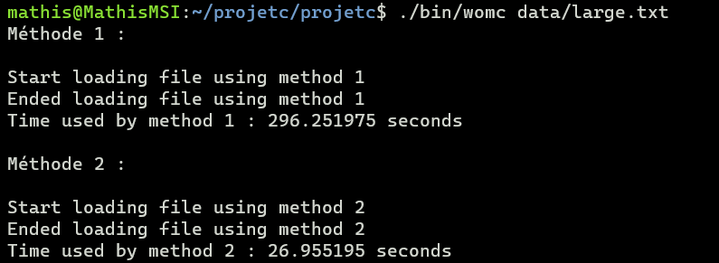

# Projet de C : Annuaire et tri de données

## Introduction

L'objectif du projet cette année est de mettre en place un gestionnaire de données du type `Prénom, Nom, Code Postal;`. La première partie définit une structure données qui n'est autre qu'une liste chaînée dans laquelle ces informations seront stockées. La deuxième partie se concentre sur la lecture des données depuis un fichier et de structuration intelligente au chargement. La troisième partie utilise une structure de données plus optimisée, une liste chaînée de listes chaînées.

## Structure de données

Les structure de données `list` et `cell`  vous sont données et permettent de définir une liste chaînées de personnes à partir de leurs informations : nom, prénom et code postal (ou `fname`, `lname` et `zip`). Un exemple d'utilisation de ces structures de données vous est illustré sur la figure ci-dessous.



```c
{
  [prénom 1, nom 1, code postal 1],
  [prénom 2, ...], 
  ...
}
```

## Lecture de données

Il faut maintenant lire les données depuis un fichier et les ajouter dynamiquement dans votre structure. Les fichiers présents dans le répertoire `data` peuvent vous servir de tests pour vos fonctions. Trois fichiers de taille différente vous sont proposés contenant respectivement 100, 30000 et 100000 entrées.

## Structure de données optimisée

Pour éviter de devoir traverser toutes les entrées en cas d'ajout d'une nouvelle, nous décidons de rajouter la première lettre de chaque nom comme caractère discriminant. Nous allons maintenant utiliser une liste chaînée de liste chaînées, la première représentant les premières lettres des noms de famille, pour accélérer l'accès aux données et l'ajout d'une nouvelle donnée. Un exemple d'utilisation est présentée sur la figure ci-dessous.


## My C-lang project documentation

### Introduction

The C project consists in loading data into a list using two methods.

### Method 1

It is a simple list. We compare the cells made from lines and then insert the cell in the right place.

### Method 2

It is an optimized list using an index. We compare the cells made from lines with an index and then insert the cell in the right index_list.

### Results

We compare the execution time of both methods using small, medium and large files.

The results are that method 2 is quicker than method 1.

Results in image :






## Installation

How to install and use the program.

### Step 1 : Download the archive

Firstly, download the archive containing every source files.

### Step 2 : Open the archive in a folder

Then, open the archive in a given folder on your computer.

### Step 3 : Open a terminal

Use the terminal (under Linux or any OS) and go to the folder containing the source code.

For example, you can be in `~/projetc $`

### Step 4 : Launch the app

From here, you can launch the app by using `./bin/annuaire`
If you don't add any arguments, like the file, it will tell you how to use the program.

Examples of usage :

```bash
./bin/annuaire data/small.txt
./bin/annuaire data/small.txt --display
```

### Step 5 : Enjoy

Enjoy the program and compare the execution time of methods.

Please consider using `./bin/annuaire` without any arguments to see complete usage and possible options.

## Credits and documentation

A documentation was generated by Doxygen in the docs directory. It can be viewed in HTML format or PDF format (compiled from LaTeX).

The original subject of this C-lang project comes from ENSTA Bretagne's courses in CSN Speciality.

Subject made by @QDucasse
